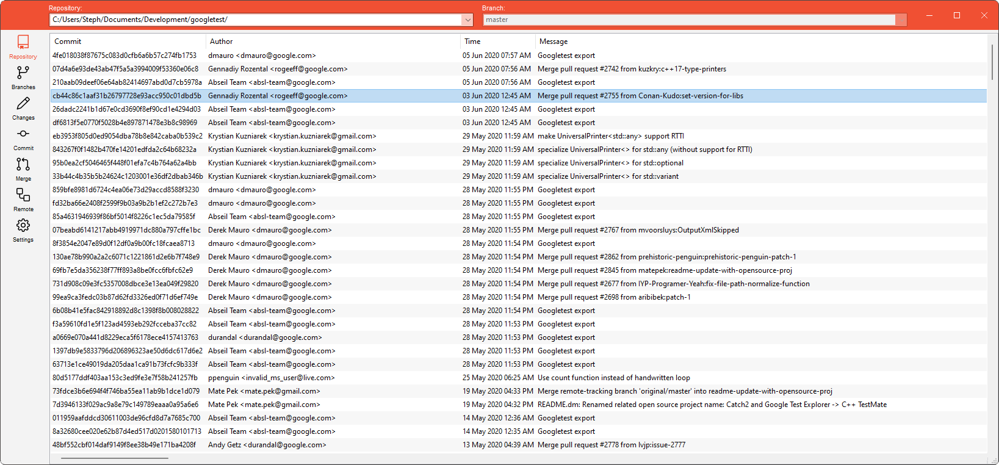

#  Fons
Short for [fons et origo](https://en.wikipedia.org/wiki/Fons_et_origo), fons is an intuitive, cross-platform tool for working with git written in C++.

# Status

Fons is currently under active development, the current code serves as a proof-of-concept for the tool and a mechanism to experiment with different features, and prototype ideas.

## Roadmap

Below is a roadmap for the planned scope of the project:

### Completed

☑️ Proof of concept

* wxWidgets GUI for browsing repository commits, branches
* Command manager supporting libgit2, filesystem operations on separate threads from GUI
* Application settings framework, example setting

### To Do

🔲 Architecture backlog

* Doxygen documentation
* Unit test suite
* Installer
* Create customized controls for branch, repository selection, easy text search
* Expand Command, Command Manager support for:
    * Blocking commands on specified resources
    * Event signaling command completion, cancellation
* OSX, Linux testing

🔲 Basic git operation support

* Init, Clone Repositories
* Create, Read, Update, Delete Branches
* Create, Amend, Push commits
* Pull, Fetch support
* Repository file browsing
* Manage Changes in Working Directory, Staging Directory, Repository
* Cherry-pick support
* Git settings support
* Git user account support

🔲 Advanced git operation support

* Granular checkout support
* Granular diff support
* Visual stash management
* Interactive rebase
* Conflict Resolution
* Search Repository (by commit ID, user, branch, filenames, file content)
* Enhanced command line prompt for git commands

🔲 GitHub, GitLab, Bitbucket support

* Repository, User icon support
* Merge Request management

# License

All code developed for fons is available under the MIT license for use in all other pojects, further details are provided in the [license file](license.md).

# Developer Documentation

Documentation for the underlying source code is hosted on Read the Docs, and can be found at [fons.readthedocs.io](https://fons.readthedocs.io).

# Credits

Fons makes use of the following libaries, tools, and resources (listed alphabetically):

* [cereal](https://uscilab.github.io/cereal/)
* [Cmake](https://cmake.org/)
* [Doxygen](https://doxygen.nl/)
* [Github](https://github.com/)
* [libgit2](https://libgit2.org/)
* [Octicons](https://github.com/primer/octicons)
* [ReadTheDocs](https://readthedocs.org/)
* [Sphinx](https://www.sphinx-doc.org/)
* [vcpkg](https://vcpkg.io/en/index.html)
* [wxWidgets](https://www.wxwidgets.org/)

Full license information for these libraries are available at the provided websites, and is also included in the fons application [info page text](gui/license_notices.txt).

Additional Thanks to (listed alphabetically):

* indi, stack exchange code reviews
* Pavel Boev, cereal-optional code
* Sy Brand, documentation tutorial for sphinx/doxygen/read the docs